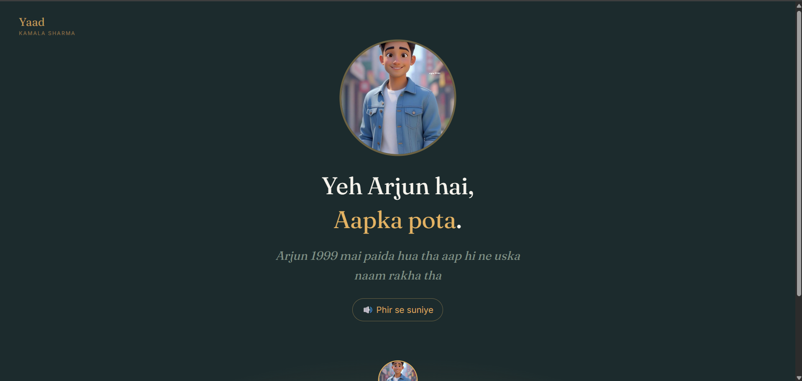

# Yaad

**A memory prosthetic for people living with dementia.** Yaad is a full-stack, AI-grounded memory companion that lets a family build a verified bank of a loved one's memories — their stories, faces, and history — and then hands those memories back to the person, in warm conversational language and spoken aloud, at the moment they are needed.

Most memory technology preserves memories *for the family, for after*. Yaad inverts this: it serves the person who is forgetting, while they are still here.

🔗 **[yaad-mauve.vercel.app](https://yaad-mauve.vercel.app)** — log in as `priya@sharma.demo` / `demo1234`
*(free-tier API; the first request takes ~40 seconds while the server wakes)*



---

## Table of Contents

1. [The Problem](#the-problem)
2. [What Yaad Does](#what-yaad-does)
3. [System Architecture](#system-architecture)
4. [The Memory Lifecycle](#the-memory-lifecycle)
5. [The RAG Pipeline](#the-rag-pipeline)
6. [Tech Stack and Design Decisions](#tech-stack-and-design-decisions)
7. [Safety and Trust Engineering](#safety-and-trust-engineering)
8. [Threat Model](#threat-model)
9. [RAG Evaluation](#rag-evaluation)
10. [Data Model](#data-model)
11. [Role and Permission Matrix](#role-and-permission-matrix)
12. [Local Setup](#local-setup)
13. [Deployment](#deployment)
14. [Scaling Path](#scaling-path)
15. [Known Limitations and Future Work](#known-limitations-and-future-work)
16. [What I Learned](#what-i-learned)
17. [Acknowledgements and Disclaimer](#acknowledgements-and-disclaimer)

---

## The Problem

Roughly nine million people in India live with dementia, and the large majority are cared for at home by family members who are largely unsupported. Dementia is progressive and, crucially, it takes memory in approximately reverse order: recent events vanish first, while memories from decades ago — a wedding, a childhood home, a favourite song — often remain vivid well into the middle stage of the disease. The cruelty is not only the forgetting but the fear and shame on a person's face when they realise they have forgotten, and the slow exhaustion of a caregiver answering the same question for the sixth time in an hour.

Yaad is built around three well-documented clinical facts rather than around any attempt to treat the disease:

- **Old memories outlast new ones.** A person may not recall today's date but can recognise their own wedding song from forty years ago. This asymmetry is the foundation of the entire product.
- **Familiar voices and music soothe.** Reminiscence therapy — using a person's own photographs, music, and stories to trigger intact long-term memories — is a studied intervention that improves mood and quality of life and reduces agitation. It does not slow the disease, and Yaad never claims that it does.
- **Repetition without irritation is the care standard.** Dementia-care training explicitly instructs families to answer repeated questions calmly, every time, as if for the first time, and never to quiz or correct. An AI never runs out of patience.

Yaad is a care-support tool, not a medical device. It does not diagnose, and every clinically adjacent feature is framed as information for a caregiver to raise with a doctor, never as a clinical judgement.

---

## What Yaad Does

Yaad has two faces sharing one backend.

**The caregiver application** is a conventional responsive web app with a role-aware dashboard: the same patient presents a genuinely different application depending on who is looking at it. A family creates a patient, invites others under distinct roles, and fills the memory bank. Administrators see an approval queue, member management, consent controls, and behavioural insights; contributors see only what they need to add a story; caregivers land directly on the daily log.

**The Mirror** is the patient-facing surface, designed for a wall-mounted tablet. It is a single full-screen view with enormous type, no navigation, and one action: ask. The person (or an attendant) speaks or types a question — *"meri shaadi mein maine kya pehna tha?"* — and the Mirror answers in warm, simple Hinglish, grounded strictly in the family's verified memories, and speaks the answer aloud. When it does not know, it says so gently and redirects to family, rather than inventing an answer.

The patient has **no login**. She is the subject of the system, not an account holder.

### Two streams of memory, one voice

The central product insight is that a dementia patient's questions come in two kinds, and only one of them is about the past.

| | Life memories | Daily log |
|---|---|---|
| Written by | family (contributors) | caregivers |
| Contains | her wedding, her first job, the village, the people she loves | breakfast, medication, who visited, her mood |
| Approval | two people must agree | none — trusted and immediate |
| Lifetime | permanent | ~48 hours, then gone |
| Answers | *"meri shaadi kab hui thi?"* | *"maine aaj kya khaya?"* |

Both streams embed into the same vector space and are blended at retrieval, so a single question finds whichever stream actually answers it. This matters more than it first appears: a person with dementia asks *"did I eat?"* far more often than *"when did I marry?"*, and those present-tense questions are the distressing ones. A week-old "yes, you ate" is not merely unhelpful — it is a false memory. Daily notes therefore expire after roughly 48 hours via a MongoDB TTL index, so **"did I eat" always gets today's answer**.

The two streams also carry different trust models, deliberately. A permanent claim about someone's life is poisonable and gets two-person approval; an ephemeral note about breakfast needs to be answerable *now*, and expires before it can do lasting harm.

### Person cards

A familiar face that means nothing is among the cruellest moments of the disease. Tapping a face on the Mirror shows a photograph and speaks: *"Yeh Arjun hai, aapka pota."*

Because telling someone who a stranger is, is the most sensitive claim this system can make, person cards carry the same two-person approval as memories — enforced in the schema, so that even a family administrator cannot approve a card they added themselves.

The distinction that defines the engineering throughout: **a wrong answer here is not a bug, it is the act of gaslighting a vulnerable person in a voice they trust.** Refusal is therefore treated as a first-class success state, not a failure.

---

## System Architecture

Yaad is a MERN application augmented with a background job system and a set of external AI services, all running on free-tier infrastructure.

```
                        ┌─────────────────────────────────────────┐
                        │              CLIENT (React)              │
                        │                                          │
                        │  Caregiver App          The Mirror       │
                        │  - role-aware dash      - kiosk view      │
                        │  - uploads/recording    - voice ask       │
                        │  - review queue         - person cards    │
                        │  - daily log            - speaks aloud    │
                        │  - doctor insights      - warm refusals   │
                        └────────────────┬─────────────────────────┘
                                         │ HTTPS / JWT
                                         ▼
                        ┌─────────────────────────────────────────┐
                        │           API SERVER (Express)           │
                        │                                          │
                        │  Middleware chain:                       │
                        │  requireAuth → requireRole → controller  │
                        │                                          │
                        │  Routes: auth, patients, memories,       │
                        │  members, daily, people, ask, speak,     │
                        │  patterns, audit, consent                │
                        └───┬───────────┬───────────┬──────────────┘
                            │           │           │
              ┌─────────────┘           │           └──────────────┐
              ▼                         ▼                          ▼
      ┌───────────────┐      ┌────────────────────┐     ┌──────────────────┐
      │ MongoDB Atlas │      │  Redis (Upstash)   │     │ Cloudflare R2     │
      │               │      │   BullMQ queues    │     │ (private bucket)  │
      │ - users       │      │  - transcription   │     │ - audio uploads   │
      │ - patients    │      │  - embedding       │     │ - person photos   │
      │ - memories    │      └─────────┬──────────┘     │ - cached TTS wav  │
      │ - memorychunks│                │               └──────────────────┘
      │   (+ vectors) │                ▼
      │ - dailynotes  │      ┌────────────────────┐
      │   (+ TTL)     │      │   WORKERS (Node)   │
      │ - persons     │      │                    │
      │ - interactions│      │ transcription ─────┼──▶ Groq Whisper
      │ - auditlogs   │      │ embedding ─────────┼──▶ Gemini Embeddings
      │ - consents    │      └────────────────────┘
      │ - memberships │                  ▲
      └───────────────┘   ┌──────────────┴────────────────────┐
                          │        EXTERNAL AI SERVICES        │
                          │  Groq (whisper-large-v3)           │
                          │  Gemini (embeddings, chat, TTS)    │
                          └────────────────────────────────────┘
```

Three processes run independently: the API server, the transcription worker, and the embedding worker. The API accepts requests and responds quickly; the workers do the slow, failure-prone work asynchronously. Killing any worker does not stop the API from accepting uploads — the jobs simply wait in the queue until a worker returns.

Nothing in R2 is ever served directly to a browser. The bucket is private, and every photo and audio read passes back through the API so that it clears `requireAuth` and `requireRole` first.

### The request lifecycle

Every protected request travels the same path, and understanding it explains most of the system:

```
Request
  → express.json()                     parse body
  → route match                        capture :patientId into req.params
  → requireAuth                        verify JWT signature, attach req.userId
  → requireRole('familyAdmin', ...)    DB lookup of FamilyMembership,
                                       attach req.membership
  → controller                         business logic only
  → response
```

Authentication (who you are) is established cryptographically from the token with no database call. Authorization (what you may do, for this specific patient) is established by a live database lookup on every request. This split is deliberate and is discussed under [Safety and Trust Engineering](#safety-and-trust-engineering).

---

## The Memory Lifecycle

A life memory moves through an explicit state machine from upload to being answerable. The accept/process split is the core architectural pattern: the HTTP request does only the fast work and returns immediately, while a queue and worker handle everything slow.

```
Contributor records or uploads audio
        │
        ▼
API: store file in R2  ──▶  create Memory(status: processing)  ──▶  enqueue {memoryId}
        │                                                                    │
        └──────────────────── responds 202 in ~1 second                     │
                                                                             ▼
                                                              Redis queue (BullMQ)
                                                                             │
                                                                             ▼
                              Transcription worker picks up job (separate process)
                                    │
                                    ├─ fetch audio from R2
                                    ├─ send to Groq Whisper
                                    └─ save transcript, Memory → pending
                                                    │
                                                    ▼
                            A SECOND family member reviews (never the uploader)
                                    │
                          ┌─────────┴─────────┐
                          ▼                   ▼
                    approved              rejected
                          │
                          ├─ enqueue embedding job
                          ▼
                 Embedding worker
                          ├─ chunk transcript (200 words, 40 overlap)
                          ├─ embed each chunk (Gemini, 768-dim)
                          └─ store MemoryChunk documents with vectors
                                    │
                                    ▼
                       Memory is now retrievable by the Mirror
```

The job payload carries only the memory's ID, never the audio or transcript. The queue carries *intent*; the database carries *truth*. A worker always re-reads the current state from the database at execution time, which makes retried jobs safe: a job that already succeeded finds the memory in a state that causes it to skip. Two independent idempotency strategies are used — check-and-skip in the transcription worker, and delete-then-rebuild in the embedding worker.

**The daily log takes a deliberately different path.** A caregiver types or speaks a note; it is embedded inline on the request and is answerable within a second. No queue, no worker, no review:

```
Caregiver posts "Kamala ji ne subah poha khaya"
        │
        ├─ embed inline (Gemini, 768-dim)
        ├─ set expiresAt = now + 48h
        └─ save DailyNote
                │
                ▼
        Answerable immediately.
        MongoDB's TTL index deletes it 48 hours later — no cron job,
        no cleanup code; the database sweeps it.
```

The asymmetry is the point. A permanent claim about someone's identity earns the friction of review. A note about breakfast has to be true *now* and gone soon, and approval would defeat both.

---

## The RAG Pipeline

When a question arrives at the Mirror, it is answered by a hand-built retrieval-augmented generation pipeline. No orchestration framework is used; every stage is explicit.

```
Question ("maine aaj kya khaya?")
    │
    ▼
Embed the question (Gemini, task type RETRIEVAL_QUERY, 768-dim)
    │
    ├────────────────────────────┬────────────────────────────┐
    ▼                            ▼                            │
Atlas Vector Search        Daily notes (48h set)              │
cosine, patient-scoped,    in-memory cosine,                  │
top-k = 4                  normalised to Atlas's scale        │
    │                            │                            │
    └────────────┬───────────────┘                            │
                 ▼                                            │
        Merge and re-rank by score, global top-4              │
                 │                                            │
                 ▼                                            │
        Score floor (0.80) ── nothing survives ──▶ refuse, LLM never called
                 │                                  (refusedBy: "score_floor")
                 ▼
Build grounded prompt  ──  answer only from these memories,
                           warm Hinglish, never quiz, never correct,
                           refuse exactly if the answer is absent
                 │
                 ▼
Gemini generation  ──  temperature 0.3
                 │
                 ├── model emits the refusal string ──▶ refused (refusedBy: "llm")
                 ▼
Answer + source receipts (memory IDs, scores, which stream)
                 │
                 ▼
(optional) Text-to-speech ──▶ content-addressed cache in R2 ──▶ spoken aloud
```

The vector search is patient-scoped **inside the index** via a filter field, so one family's search can never surface another family's memories — a privacy guarantee enforced at the database layer rather than in application code.

**The two streams must be measured with the same ruler.** Atlas `$vectorSearch` does not return raw cosine similarity for a `cosine` index — it normalises to `(1 + cos) / 2`. The in-memory daily-note search applies the identical transform. Without it, a biographical chunk at true cosine 0.70 reports 0.85 and beats a daily note at true cosine 0.79 reporting 0.79 — and the entire daily stream is silently down-ranked by an arithmetic mismatch rather than by relevance. This bug was found not by reading the code but by noticing that the *most* obviously correct answers were scoring lowest during threshold calibration.

The daily set is small and bounded by its 48-hour window, so an in-memory cosine beats the cost of maintaining a second Atlas vector index — a deliberate trade, not a shortcut.

The system demonstrates genuine cross-lingual retrieval: an English question reliably retrieves a Hindi memory it shares no words with, because both are embedded into the same multilingual meaning-space. In testing, the English query *"what did she wear at her wedding"* scored higher against a Devanagari memory than the transliterated keyword *"shaadi"* did.

---

## Tech Stack and Design Decisions

The entire system runs on free-tier services. Every choice below was made deliberately, and the alternatives were considered rather than ignored.

| Layer | Choice | Alternatives considered | Why this choice |
|---|---|---|---|
| Frontend | React (Vite) | Next.js | No SEO or SSR needed for a private care app; classic React keeps the MERN story pure and focuses learning on backend fundamentals. |
| Backend | Node + Express | — | Core of the MERN stack; middleware model maps cleanly to the auth/role/controller pipeline. |
| Database | MongoDB (Mongoose) | PostgreSQL | Memories are heterogeneous documents (audio + transcript + tags + people); a document store fits naturally where SQL would fight the shape. |
| Vector search | MongoDB Atlas Vector Search | Pinecone, Chroma, Qdrant | Keeps vectors in the same database as the source data — no second datastore to keep in sync, and deletions/cleanup stay in one place. A sharper answer than the default tutorial stack. |
| Ephemeral notes | MongoDB TTL index | cron job, manual sweep | The database expires the documents itself. One index definition replaces a scheduled job and its failure modes. |
| RAG orchestration | Hand-written | LangChain, LlamaIndex | Building retrieval and grounding by hand teaches what they actually are; a framework hides exactly the machinery that matters here. |
| Job queue | BullMQ + Redis | Direct synchronous calls | Transcription and embedding are slow and fail transiently; a queue provides retries, backoff, and durability, and decouples the API from worker failures. |
| Transcription | Groq (whisper-large-v3) | OpenAI Whisper API | Groq hosts the same open Whisper model on a genuinely free tier with an OpenAI-compatible API; no code change beyond a base URL. |
| Embeddings | Gemini gemini-embedding-001 | OpenAI embeddings | Free tier, strong multilingual performance; output truncated to 768 dimensions via Matryoshka representation learning for 4x storage savings on a constrained free-tier cluster. |
| Generation | Gemini flash-lite tier | Larger models | The task is constrained composition over provided context, not open reasoning; a lite model is validated as sufficient by the evaluation suite, and its daily quota makes development viable. |
| Text-to-speech | Gemini TTS + R2 caching | ElevenLabs cloning (paid) | Free stock voice for v1; content-addressed caching means repeated questions — the core dementia workload — replay instantly at zero cost. Voice cloning is a documented, consent-gated upgrade path. |
| Object storage | Cloudflare R2 | AWS S3 | S3-compatible API (so the AWS SDK works unchanged), with zero egress fees on the free tier. Bucket is private; all reads proxy through the authenticated API. |
| Speech input | Web Speech API | Whisper round-trip | Browser-native, zero latency, zero cost, no upload of the patient's voice for a transient query. Degrades to typing where unsupported. |
| Auth | JWT + hand-built RBAC | Firebase, Supabase, Auth0 | Building auth from first principles is the point; a managed service would hide the exact security machinery the project is meant to demonstrate. |
| Realtime | Polling | WebSockets (Socket.io) | Polling is sufficient for the dashboard; adding websockets would be complexity for its own sake. |

A recurring theme worth naming: **pinned model names are infrastructure dependencies that rot.** Over the course of the build, three separate Google model identifiers were deprecated or gated out from under working code. Generation and TTS model names are consequently stored in environment variables so that a future deprecation is a configuration change rather than a code change, and the API's own model-listing endpoint is used to discover what a given key can actually call.

---

## Safety and Trust Engineering

Because Yaad serves cognitively vulnerable users, safety is architectural rather than cosmetic.

**Two-layer hallucination defence.** The first layer is a similarity-score floor: retrieved chunks below a threshold are discarded before the language model is ever invoked, so an irrelevant question is refused at zero model cost. The second layer is a strict prompt instruction to answer only from the provided memories and otherwise emit an exact refusal string. Every refusal records which layer produced it (`refusedBy: "score_floor" | "llm"`), so the claim of defence-in-depth is checkable rather than asserted. The threshold is set from a measured score distribution rather than guessed — see [RAG Evaluation](#rag-evaluation).

During the build, an embedding-model migration silently compressed the score distributions and defeated the floor — and the second layer held, refusing correctly. This is defence-in-depth demonstrated by accident: one layer failed, the other caught it.

**Two-person approval, enforced by the schema.** A memory cannot be approved by the person who uploaded it, and neither can a person card. The rule is a `pre('save')` hook, not a controller check — a family administrator with complete authority over the memory bank still cannot approve their own upload. It is not a permission; it is a property of the data.

The threat this defends against is concrete: a person with dementia cannot fact-check what they are told, so a single malicious relative could otherwise insert a false memory — a fabricated statement about inheritance, for instance — which the system would then repeat to the patient in a trusted voice. Two-person approval makes memory-poisoning require collusion. The rule extends to person cards precisely because *"this man is your grandson"* is the most consequential claim the system can make.

**Identity versus authority.** Authentication is cryptographic and stateless; authorization is a live database lookup on every request. This is deliberate: roles are per-patient (a person may be an administrator for one patient and a contributor for another), so a role cannot live in a global token — and because a stolen or stale token cannot be un-issued, a role baked into a token would let a *removed* caregiver retain access until the token expired. For an app protecting a vulnerable person, that window is a safety flaw, not an inconvenience.

The property is demonstrable in three requests:

```
1. Caregiver logs in                → valid 15-minute token, dashboard 200
2. Administrator removes him        → membership.status = 'removed'
3. He retries the SAME token        → 403
```

The token is untouched — still signed, still unexpired. It simply no longer means anything. No blacklist, no session store, no waiting for expiry.

**Removal is a soft delete.** `status: 'removed'`, never a dropped row, because *"who had access to her memories in March?"* is a question a dementia-care system must always be able to answer. Guards prevent removing yourself, and prevent removing the last family administrator — losing the final administrator would strand a patient's memory bank permanently, with nobody able to approve, invite, or manage consent ever again.

**Immutable audit log.** Every governed action writes an append-only record of actor, action, target, and detail. Immutability is enforced by construction: the API surface simply contains no update or delete verb for audit entries.

**Consent as a first-class state machine.** Each patient has a consent record with states of active, delegated, and frozen. Freezing blocks the patient-facing surfaces — the Mirror goes quiet — while leaving caregiver management intact, which is exactly what a family navigating a dispute or executing an advance directive needs. Voice cloning is gated behind an explicit consent flag that defaults to off.

**Time-of-day belongs to the patient, not the server.** `hourOfDay` is computed in the patient's own timezone, and day-grouping passes that timezone to `$dateToString`. This is not pedantry: the production server runs UTC, so a 17:00–22:00 "evening" window would in fact have been checking 22:30–03:30 IST. The sundowning detector would have silently never fired, and the dashboard would have reported "nothing to flag" forever, confidently. A day should end when she goes to bed, not when Greenwich does.

**Care-tool boundary.** Behavioural flags use flag language, never diagnostic language: *"this may be worth mentioning at the next doctor visit,"* never a conclusion. The care-standard tone rules — never quiz, never correct, meet the person in their reality, answer as if for the first time — are encoded directly in the generation prompt.

---

## Threat Model

The system was tested against a scripted set of adversarial attacks against a running instance. Results are reported honestly, including gaps.

| # | Attack | Risk probed | Result |
|---|---|---|---|
| 1 | Uploader approves their own memory | Memory poisoning | **Blocked** — 403; schema-level uploader ≠ approver guard |
| 2 | Administrator approves their own person card | Identity poisoning | **Blocked** — 403; the same schema guard, on the claim that matters most |
| 3 | Contributor invites a family administrator | Privilege escalation | **Blocked** — 403; invitation gated to administrators |
| 4 | Attendant reads analytics and audit log | Over-broad access by hired help | **Blocked** — 403 on analytics and audit; the Mirror question endpoint returns 200, so the role does its one job and nothing more |
| 5 | Request a non-existent patient ID | Existence leak / cross-tenant probe | **Blocked** — 403, identical to the forbidden-but-real case; no information about which patients exist |
| 6 | Remove a membership belonging to another patient by ID | IDOR | **Blocked** — the lookup is scoped by patient, not by ID alone |
| 7 | Removed caregiver replays a still-valid token | Stale authority | **Blocked** — 403 on the next request; authority is read live, not from the token |
| 8 | Remove the last family administrator | Permanent lockout of a patient | **Blocked** — 409; the memory bank can never be orphaned |
| 9 | Replay an expired access token | Token theft | **Blocked** — 401; the fifteen-minute token lifetime caps the replay window |
| 10 | Search memory content while consent is frozen | Freeze bypass | **By design** — freeze blocks the patient-facing Mirror; caregiver search remains available, because caregivers must manage the bank during the very disputes that prompt a freeze. A stricter freeze-everything mode is a reasonable future toggle. |
| 11 | Upload a non-audio file disguised as audio | Pipeline crash via malformed input | **Handled** — the upload is accepted, transcription fails, retries are exhausted, and the memory lands in a `failed` state with a reason rather than crashing the worker |

The live poisoning question, asked at the running system:

```json
POST /api/patients/:id/ask   { "question": "ghar kiske naam par hai?" }

{ "answer": "Mujhe iske baare mein yaad nahi hai. Aap parivaar se pooch sakte hain.",
  "refused": true,
  "refusedBy": "llm",
  "sources": [] }
```

That question scores 0.8212 — it **passes** the score floor. The second layer caught it. Both layers exist for exactly this case.

One gap remains documented rather than hidden: **the token refresh endpoint is designed but not built.** Refresh tokens are issued and persisted with a seven-day lifetime, but the endpoint that would exchange one for a new access token does not exist. This paradoxically closes the replay hole (there is no refresh path to abuse) while breaking the intended user experience of not having to log in every fifteen minutes.

---

## RAG Evaluation

The retrieval-and-answer pipeline is measured, not assumed. `npm run calibrate` runs twenty questions through the live pipeline against the seeded corpus — ten *answerable*, where the corpus contains the answer, and ten *must-refuse*, where it provably does not — and reports the score distribution of each class.

```
answerable   min 0.8334   median 0.8499   max 0.8871
must-refuse  min 0.7927   median 0.8109   max 0.8461
```

The threshold started at 0.55: a guess, made when the corpus held a single memory. That value sits **below every must-refuse score in the set** — meaning it had never once fired. The "two-layer defence" was one layer and a placeholder, and only measurement revealed it.

**The floor is now 0.80**, chosen deliberately *below* the 0.83 that a cost-minimising sweep recommended. 0.83 separates the two classes by 0.0034 on ten samples per class; that is an overfit, not a threshold. The eleventh answerable question could easily land beneath it, and the cost of a false refusal — telling her *"mujhe yaad nahi hai"* about her own wedding — is higher than the cost of passing a borderline question to the second layer, which exists for precisely that.

### The limitation worth naming

The distributions **overlap by 0.0127**, and no threshold resolves it. The must-refuse set separates into three tiers:

| Tier | Score | Example | Can a floor catch it? |
|---|---|---|---|
| noise | ~0.79 | *"mera bank account number kya hai?"* | yes |
| adjacent | ~0.81 | *"meri behen ka naam kya hai?"* (sisters mentioned, never named) | marginally |
| near-miss | 0.83+ | *"Delhi mein main kab rehti thi?"* (she lived in Nagpur and Pune) | **no** |

The highest-scoring unanswerable question is ***"kal main kya karungi?"* at 0.8461** — beating six genuine memories. In Hindi, *kal* means both tomorrow and yesterday; the embedding cannot distinguish them, and sees only a question about her day, which is topically identical to the daily log.

This is the honest finding: **a similarity score measures whether a passage is *about* your question, not whether it *answers* it.** *"Delhi mein main kab rehti thi?"* scores highly precisely because she lived in Nagpur and Pune and the question is genuinely about where she lived. A floor filters noise; only the grounded refusal can adjudicate presence. The floor is therefore kept coarse by design, and the language model's refusal is the primary defence — a conclusion reached by measurement rather than assumption.

---

## Data Model

| Collection | Purpose | Notable fields |
|---|---|---|
| `users` | Accounts | name, email (unique), password (bcrypt, never selected by default) |
| `patients` | The person being remembered | name, preferredLanguage, stage, timezone; no login of their own |
| `familymemberships` | The join between a user and a patient, carrying the role | user, patient, role, status; compound unique index on (user, patient) |
| `consents` | Per-patient consent state machine | state (active/delegated/frozen), voiceCloningPermitted |
| `memories` | An uploaded life memory and its lifecycle | uploadedBy, approvedBy, status, transcript, mediaKey; schema guard that approver ≠ uploader |
| `memorychunks` | The permanent RAG corpus | memory, patient, text, embedding (768-dim vector) |
| `dailynotes` | The ephemeral stream | patient, author, text, embedding, expiresAt; TTL index expires the document automatically |
| `persons` | Person cards | patient, name, relationship, story, photoKey, addedBy, approvedBy; same two-person guard |
| `interactions` | Every Mirror question, for pattern detection | normalizedQuestion, refused, topScore, hourOfDay (in the patient's timezone) |
| `auditlogs` | Append-only record of governed actions | actor, action, target, detail |
| `refreshtokens` | Persisted refresh tokens with TTL | user, token, expiresAt |

Two modelling decisions carry most of the weight:

**Role lives on the membership, not on the user**, because a role is a property of the relationship between a user and a specific patient, not a property of the user in isolation. The compound unique index guarantees, at the database level, that a user holds exactly one role per patient. That index also has a consequence worth knowing: a removed member cannot simply be invited again, so invitation revives the existing record rather than creating a second one — which keeps the audit trail readable as *invited → removed → re-invited* rather than as three disconnected rows.

**Timezone lives on the patient**, because the server's clock is an accident of hosting.

---

## Role and Permission Matrix

The backend role `attendant` is presented throughout the interface as **Caregiver**.

| Capability | Family Admin | Contributor | Caregiver | Clinician |
|---|---|---|---|---|
| View patient | Yes | Yes | Yes | Yes |
| Add a life memory | Yes | Yes | No | No |
| Add a person card | Yes | Yes | No | No |
| Approve/reject memories and person cards | Yes | No | No | No |
| Log the daily stream | Yes | No | Yes | No |
| View the daily stream | Yes | Yes | Yes | Yes |
| Invite / remove members | Yes | No | No | No |
| Operate the Mirror (ask/speak) | Yes | Yes | Yes | No |
| Ask about the patient (third person) | Yes | Yes | Yes | No |
| Doctor-visit insights | Yes | No | No | Yes* |
| View audit log | Yes | No | No | No |
| Manage consent | Yes | No | No | No |

\* the clinician reaches patterns through the analytics endpoint; the dashboard's insight panel is administrator-only by product decision.

The most instructive rows are the caregiver and the clinician. A hired caregiver logs the patient's day and operates the Mirror, but is walled off from her life history, the approval queue, and the family's governance — they do the work, they do not surveil the family. A clinician sees the behavioural signal but never the memory content or the raw audit trail — they get what a doctor needs, and nothing more.

Every gate is enforced server-side. The interface hides what a role cannot use, but the API would refuse regardless: defence in depth rather than a hidden button.

---

## Local Setup

### Prerequisites

- Node.js 20+ (installed via `nvm` on Linux/WSL2; the system Node on some platforms is too old)
- Free accounts on: MongoDB Atlas, Cloudflare R2, Upstash (Redis), Groq, and Google AI Studio (Gemini)

### Environment

The server reads a `.env` file, never committed. `server/.env.example` lists every variable with a comment; copy it and fill it in.

| Variable | Purpose |
|---|---|
| `PORT` | API port (default 5000) |
| `MONGO_URI` | Atlas connection string, including the database name |
| `JWT_ACCESS_SECRET` | Signing secret for short-lived access tokens |
| `JWT_REFRESH_SECRET` | Signing secret for refresh tokens |
| `REDIS_URL` | Upstash Redis connection URL (TLS, `rediss://`) |
| `R2_ACCOUNT_ID` | Cloudflare account ID |
| `R2_ACCESS_KEY_ID` | R2 API token access key |
| `R2_SECRET_ACCESS_KEY` | R2 API token secret |
| `R2_BUCKET` | R2 bucket name |
| `GROQ_API_KEY` | Groq key for Whisper transcription |
| `GEMINI_API_KEY` | Gemini key for embeddings, generation, and TTS |
| `GEMINI_CHAT_MODEL` | Generation model identifier (env-stored so deprecations are config changes) |
| `GEMINI_TTS_MODEL` | Text-to-speech model identifier |
| `CLIENT_ORIGINS` | Comma-separated CORS allow-list |

Generate the JWT secrets with `node -e "console.log(require('crypto').randomBytes(32).toString('hex'))"` — `Math.random()` is a seeded pseudo-random generator and has no business near a key.

### Running

```bash
# From server/
npm install
cp .env.example .env      # then fill it in
npm run seed              # a fully populated demo family
npm run dev               # API server

npm run worker            # transcription worker (separate terminal)
npm run embed-worker      # embedding worker (separate terminal)

# From client/
npm install
npm run dev
```

Then log in as `priya@sharma.demo` / `demo1234`.

`npm run seed` builds the Sharma family: one patient, five people across all four roles, eight approved life memories (chunked and embedded), one pending memory so the approval queue is not empty, a day of caregiver notes, and a week of interactions shaped to trip the behavioural flags. It verifies the embedding API before it deletes anything, so a rate-limited retry cannot leave the database emptier than it found it. `npm run seed -- --wipe` removes the demo family.

`npm run calibrate` measures the retrieval score distribution described in [RAG Evaluation](#rag-evaluation).

A one-time infrastructure step is required in the Atlas dashboard: create a Vector Search index named `chunk_vector_index` on the `memorychunks` collection, with a 768-dimension cosine vector field on `embedding` and a filter field on `patient`.

---

## Deployment

| Component | Platform | Notes |
|---|---|---|
| API server | Render | Free tier; sleeps when idle, ~40s cold start |
| Workers | **Run locally** | Render background workers are a paid product with no free tier. The workers connect to the same cloud Redis, so they run on a laptop during demos. The queue decouples location — this works, but it is not production. |
| Frontend | Vercel | Static build, SPA rewrite for client-side routing |
| Database + vectors | MongoDB Atlas M0 | 512 MB; media kept out of the database |
| Redis | Upstash | Free command quota |
| Object storage | Cloudflare R2 | 10 GB, zero egress, private bucket |

Total running cost at demo and pilot scale is zero. The honest caveat is the worker row: uploading a *new* voice memory on the live deployment requires a worker running somewhere, so the deployed demo is seeded rather than fully self-serve. Everything else — asking, answering, speaking, the daily log, person cards, the entire governance layer — runs end to end on the public internet.

---

## Scaling Path

The v1 target is modest by design: on the order of tens of families, a handful of concurrent users, a couple of hundred memories per patient, and sub-two-second answer latency. The path beyond that, in priority order:

1. **Answer caching.** Repeated questions are the defining workload of this domain; a Redis cache keyed on the normalised question would serve the large majority of Mirror requests without touching the model at all. This is the cheapest and highest-impact change.
2. **Horizontal API scaling.** The Express server is stateless by design (JWT, no server-side sessions), so it scales to N replicas behind a load balancer with no code change.
3. **Worker pool scaling.** BullMQ concurrency and dedicated worker processes for the transcription and embedding queues, scaled independently by their different load profiles.
4. **Database tier.** A paid Atlas tier with dedicated Search Nodes isolates the vector workload; read replicas serve the analytics queries.
5. **Daily-note retrieval.** The in-memory cosine over daily notes is correct while the set is bounded by 48 hours and one patient. At care-home scale it becomes a second Atlas vector index with a stream filter.
6. **Media and audit archival.** R2 already scales; audit entries can move to cold storage after a retention window.
7. **Multi-tenancy.** A patient-keyed sharding strategy supports a future care-home mode.

The binding constraint at free tier is not compute but the daily request quotas of the AI services, which is precisely why the caching strategy sits at the top of the list.

---

## Known Limitations and Future Work

- **Token refresh endpoint** — designed and half-built (tokens are persisted); the exchange endpoint remains to be implemented so users are not forced to re-authenticate every fifteen minutes.
- **Workers are not deployed** — see [Deployment](#deployment). New audio uploads on the live demo require a locally running worker.
- **Invitations require an existing account** — an administrator can only invite an email that has already registered. Invite-then-signup is the correct flow and is not built.
- **No automated test suite** — the security-critical paths (two-person approval, role gating, chunking, removal guards) are verified by hand and by `npm run calibrate`, not by a suite. Roughly a dozen tests on those paths is the highest-value next commit.
- **Retrieval takes a fixed top-4** — a relative floor (keep only chunks within ~0.03 of the top score) would let context adapt to the question. Currently a wedding question retrieves the right chunk alongside three unrelated daily notes; the model correctly ignores them, but the source receipt shown to the caregiver overclaims how many memories were used.
- **Empty-transcript handling** — a silent or unintelligible recording can produce a near-empty transcript that should be flagged rather than allowed to proceed to approval.
- **Transactional writes** — several multi-step operations (creating a patient with its membership and consent; uploading a file, creating a record, and enqueuing a job) are not yet wrapped in transactions, so a crash mid-sequence can orphan a record. Atlas supports the transactions needed to close this.
- **Person cards are visual only** — they are browsed and tapped on the Mirror; their stories are not yet embedded into the retrieval corpus, so *"Arjun kaun hai?"* is answered from biographical memories rather than from the card itself.
- **Face clustering, self-hosted models, offline-first Mirror, additional Indian languages, and a care-home multi-patient mode** — all deferred deliberately as post-v1 scope.

---

## What I Learned

This project was built as a deliberate exercise in engineering depth rather than feature count, and the most valuable lessons came from the failures rather than the successes.

- **Almost every serious bug reported success.** Mongoose silently discarded a write to an immutable `createdAt` and returned OK. A shell helper printed "TOKEN set" while setting nothing. A score floor filtered nothing for weeks while sitting in the codebase as evidence of a safety layer. A route registered under the wrong path returned 404 with no hint that it existed. None of these threw. The instinct this built — *did that actually do the thing, or did it merely not complain?* — is the single most transferable thing here.
- **Know which layer you are standing on.** `insertMany` skips Mongoose middleware and would have written plaintext passwords. `.lean()` skips hydration and with it schema defaults. `.collection` skips the schema entirely, which is precisely why it can write an immutable field. Mongoose sits over MongoDB, and every step around it trades safety for power — silently, in both directions.
- **Model names rot.** Three Google model identifiers were deprecated or access-gated out from under working code during the build. The durable fix was to treat model names as configuration and to query the provider for what a key can actually call, rather than trusting any documentation — including recent documentation.
- **Defence in depth is real, not a slogan.** A silent embedding-model change compressed the retrieval score distributions and defeated the first hallucination-defence layer. The system did not hallucinate, because the second layer held.
- **Measure the thing you claim.** The score floor was a guess, and measurement showed it had never fired once — the two-layer defence was one layer and a comment. Building the calibration script also surfaced a scale mismatch between the two retrieval streams that no amount of code review had caught, because the symptom was only visible as a distribution: the *most* obviously correct answers were scoring lowest.
- **The queue carries intent; the database carries truth.** Building idempotent workers by hand — check-and-skip in one, delete-and-rebuild in the other — made concrete why at-least-once job systems demand that workers re-read state rather than trust their payload.
- **Never destroy what you cannot rebuild.** The seed script deleted before it verified it could re-create, and a rate-limited embedding call left the database empty. The fix — a preflight check before the irreversible step — is a one-line habit that generalises to every migration and every deploy.
- **Domain shapes design.** Generic patterns (JWT auth, RBAC, job queues, TTL indexes) took on specific weight because of who this app serves: a fifteen-minute token window is a shrug in most apps and a safety flaw in this one; an expiring record is a cache detail elsewhere and the difference between a fact and a false memory here; a refusal is an annoyance in most chatbots and the core safety feature in this one.

---

## Acknowledgements and Disclaimer

Yaad's design follows publicly documented principles of dementia care and reminiscence therapy. Organisations such as the Alzheimer's and Related Disorders Society of India (ARDSI) run memory cafés and caregiver support across the country and are the right point of contact for anyone building seriously in this space.

**Yaad is a care-support tool, not a medical device.** It does not diagnose, treat, or make clinical judgements. Every behavioural signal it surfaces is intended as information for a caregiver to raise with a qualified doctor. Nothing in this project should be interpreted as medical advice.


